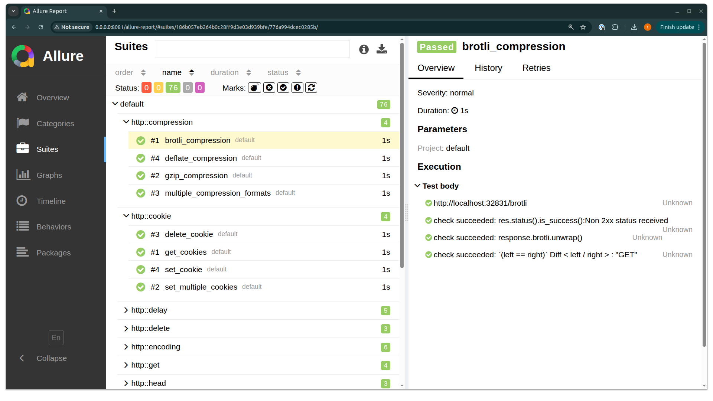

# tanu-allure

[](https://crates.io/crates/tanu-allure) [](https://docs.rs/tanu-allure) [](LICENSE)

An Allure reporter plugin for [tanu](https://github.com/tanu-rs/tanu) that emits Allure-compatible JSON for every executed test. The reporter implements `tanu_core::Reporter` and stores results in a directory you control, ready to be rendered with the Allure CLI.



## Installation

Add the crate to your workspace alongside `tanu`:

```toml
[dependencies]
tanu-allure = "0.6"
```

## Usage

1. Build your test runner with `tanu`.
2. Install the reporter on your app before running the suite.
3. Point the reporter to the directory where you want Allure JSON artifacts written.

```rust
#[tanu::main]
#[tokio::main]
async fn main() -> tanu::eyre::Result<()> {
    let runner = run();
    let mut app = tanu::App::new();
    app.install_reporter(
        "allure",
        tanu_allure::AllureReporter::with_results_dir("allure-results"),
    );
    app.run(runner).await
}
```

Once the plugin is installed, select it when invoking your suite (for example `cargo run test --reporters allure,list`) so `tanu` includes the Allure reporter alongside any other reporters you use.

`AllureReporter::new()` uses `allure-results/` in the current working directory; `with_results_dir` lets you target another location (for example, inside your CI artifacts directory). Each completed test produces a `*-result.json` file containing the full execution trace, including checks and HTTP calls captured by `tanu`.

## Generating a report

1. Run your `tanu` suite so the reporter can populate `allure-results/`.
2. Install the Allure CLI:
   - Follow the official installation instructions: https://allurereport.org/docs/install/
   - Or build it in a container using the provided [example/Dockerfile](example/Dockerfile).
3. Turn the JSON into HTML assets:

   ```sh
   allure generate allure-results --clean -o allure-report
   ```

   Use `allure serve allure-results` for an ad-hoc preview that spins up a temporary web server.

## Publish test report in GitHub Pages

A ready-to-use GitHub Actions workflow lives at [.github/workflows/publish-report.yml](.github/workflows/publish-report.yml). It builds the example project, generates `allure-report/`, and publishes the site to GitHub Pages. The live report produced by that workflow is available at https://tanu-rs.github.io/tanu-allure/.

Adapt the workflow to your repository by replacing the example build/run steps with the commands your project requires.

## Example project

This repository ships a runnable example that fetches `https://httpbin.org/get` and records the steps:

```sh
cargo run --manifest-path example/Cargo.toml test --reporters allure,list
```

Running it regenerates `allure-results/` with fresh output. Open the directory with the Allure CLI to inspect the resulting test case.

